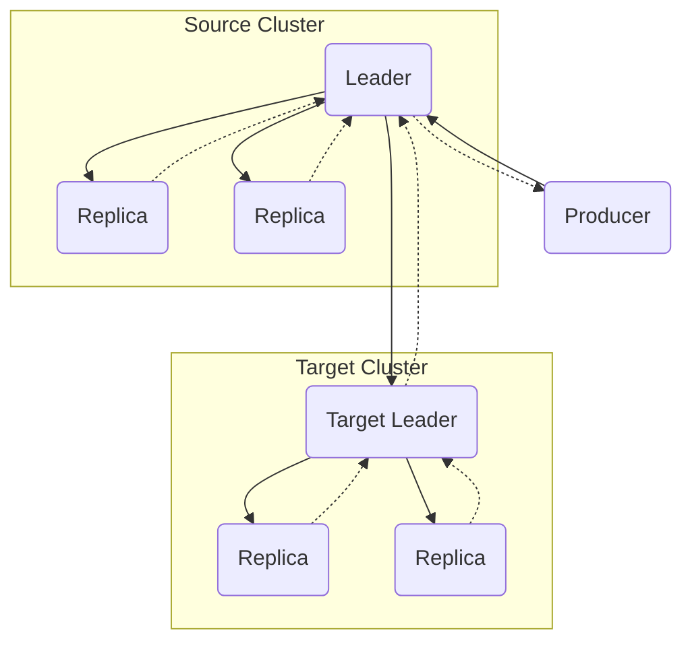

Replication Link Data & Acks Topology
* Solid arrows are data
* Dotted arrows are acks

Only one data/acks pair passes the cluster boundary, so the cost of performing replication and the number of outbound connections is kept low.

Producers are not aware that the target cluster exists and is replicating the data, except for the ack latency.

For a link which is replicating N topic-partitions including the __consumer_offsets topic, the number of connections should be N + 1.
This is because one connection is established between controllers to communicate metadata about the link bidirectionally.

