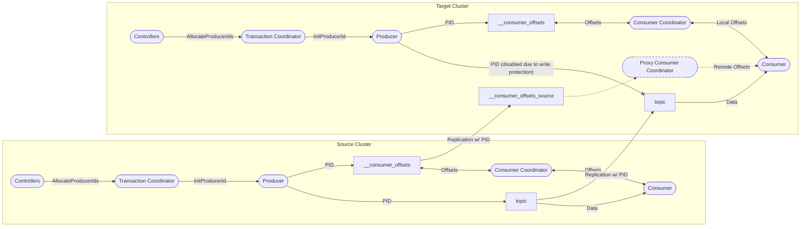

# Consumer Offsets 

Propagating consumer offsets (and general group metadata) from source cluster to target cluster

Because different clusters have different sets of controllers, and allocate Producer IDs independently, topics cannot contain PIDs allocated by both clusters concurrently.
* This has to be enforced on the target side by write-protecting the remote topics
* For normal topics this is enforced in the outward UX of the feature: remote topics are not writable until the link is Disconnected.
* It is not possible to write-protect __consumer_offsets without interrupting the target cluster, so an alternative topic name is necessary.

How can consumers interact with the read-only __consumer_offsets_source topic?
* We could prevent the consumers from joining reserved groups entirely 
  * This would prevent "double consumption" of the same partition in the "same group" on both the source and cluster side
  * Applications doing "cache warming" while the replication link is ongoing would need to use distinct consumer groups
* New read-only "Proxy Consumer Coordinators" could be initialized to read from the mirrored __consumer_offsets_source partitions
  * When answering a FindCoordinator request, a broker can find the reservation containing that group, and direct the consumer to the Proxy Coordinators for that reservation.
  * Consumers on the target cluster would be able to join the group and read the latest committed offset, but not commit offsets.

After disconnecting a link, some cleanup needs to take place
* The latest state of the __consumer_offsets_source topic needs to be appended to the primary __consumer_offsets topic
* This involves a reshuffling if the number of partitions is different, perhaps Consumer Coordinators could contact the ProxyConsumerCoordinators
* The group reservation needs to be removed so that consumer groups can be brought up on the target cluster
* The proxy consumer coordinators need to be stopped
* The __consumer_offsets_source topic needs to be deleted

Replication Cost & Privacy
See [Per Key Permissions](per-key-permissions.md) discussion on how privacy for the __consumer_offsets topic is managed.