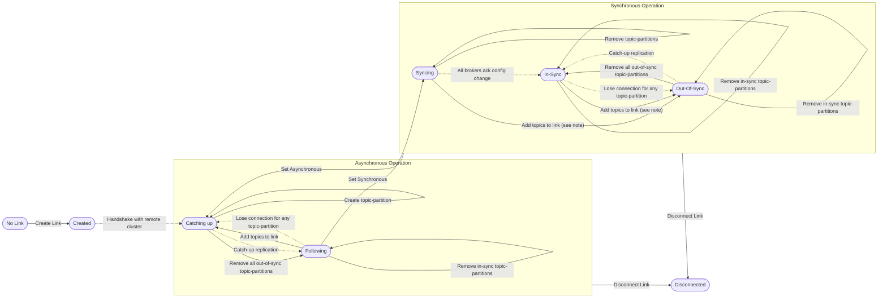

# Replication Link States
* Solid arrows are initiated by the AdminClient
* Dotted arrows happen due to background processes, changes in the hardware or network

Individual brokers do not depend on the global state of the link, and instead operate based on their copy of the metadata.
If their copy of the metadata says the link is synchronous, they will delay acks as necessary.

A link can only guarantee exactly once delivery when all brokers are in the In-Sync or Out-Of-Sync states.
No automatic transitions out of these states are allowed, in order to preserve this property.
Making the link asynchronous immediately voids this guarantee, even if some brokers are still "in-sync" or "out-of-sync".
One can get a summary of the guarantees at any point in time by examining the link state persisted by the _active controller of the source cluster_.

### In Sync -> Out Of Sync Manual Transition
* The "Out-Of-Sync" link state causes the added source topics to be offline for transactional producers, and should be avoided
* If existing topics are added to the link via AdminClient, then the state will change as those topics may be nonempty, and have a backlog of data that needs to be replicated.
* This state change is temporary, as the topic may quickly replicate. But until it catches up, the link is degraded.
* To avoid this, operators should first change the link to asynchronous and then add the topics.
  * This is a footgun, should this state transition be disallowed?
  * It would be useful in hardening the system as it allows users to deliberately make the link out-of-sync to stop upstream producers to test the failure mode
  * It is obviously dangerous in a production environment, maybe it should have different permissions than adding topics to async links.

