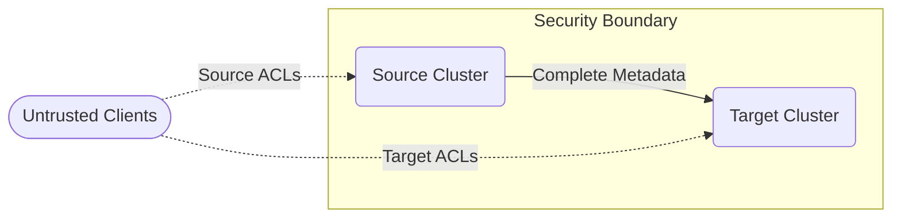
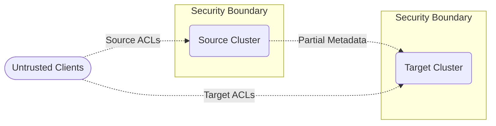
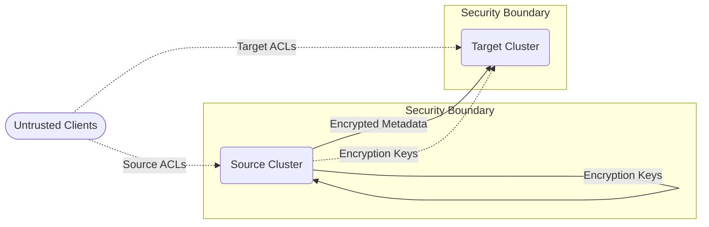
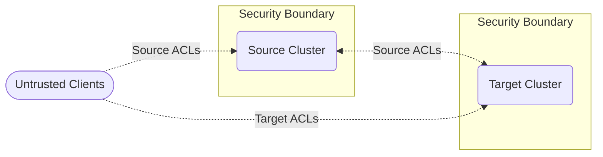

# Internal Topics Security Model
Generally, a topic is the smallest unit of permissions that can be granted in Kafka.
Either an actor has permissions to read a topic and all of its contents, or it doesn't.

This is in conflict with Kafka's usage of the __consumer_offsets, __transaction_state, and __cluster_metadata topics.
These topics aren't meant to be accessed by clients, and instead are only readable by the brokers themselves in order to conduct cluster operations.

The data within these topics is extremely relevant to the operation of a cross-cluster replication link:
* Consumers failing over to the target cluster should have consumer offsets to restore from
* When disconnecting a link, it is valuable to know the set of open transactions to then perform an orderly abort.
* The link needs to discover the topics and leaders of the replicated topics, and could do so via the metadata topic

However, these topics are also very sensitive, and contain data about the whole cluster, while a link can be restricted to just a subset of the cluster.
Therefore, some strategy for restricting a link's exposure to this metadata is necessary.

## Option 1: Trust Target Implicitly 

A replication link provides no security isolation of the source cluster from the target cluster.
By establishing a replication link of any size or complexity, you also give the target cluster permissions to access arbitrary internal data to perform its functionality.

#### Advantages
* Cheapest computationally
* Allows link to be reconfigured after replication takes place, and relevant data is already present

#### Disadvantages
* May incur additional data transfer costs for replicating metadata that goes unused
* An untrusted target cluster could give out more generous ACLs than the source cluster
* An untrusted target cluster could discover topics, consumer groups, and transactions that the link does not include.

## Option 2: Replication-Time Redaction

A replication link executes some security policy at replication-time, and redacts sensitive data as it exits the cluster.
The target cluster only ever receives redacted data, and then cannot see anything it is not configured for.

#### Advantages
* Some computational overhead in redacting the topic on egress
* Incurs data transfer costs only for metadata that is necessary

#### Disadvantages
* Reconfiguring the link to include additional consumer groups will only receive the consumer offsets after the next offset commit

## Option 3: Egress Encryption

A replication link has its source cluster encrypt each record with a per-key encryption-key as it exits the cluster.
The source cluster persists the encryption keys in a new topic __target_encryption_keys.
__target_encryption_keys is never accessible from the target cluster.
The target cluster persists the encrypted data, and can keep a view of the compacted topic in-memory. 
When a replication link is given permission to read a key from the already-replicated topic for the first time, the source cluster sends the corresponding encryption key.
At this point, all of the past history of that key is now accessible to the target cluster.

#### Advantages
* Once a source cluster disconnects the link and discards the encryption keys, the remaining encrypted data on the target system is useless
* Allows for late-adding a resource to the link and getting the full history of that key

#### Disadvantages
* Complex, with many opportunities for security holes
* Requires new mechanisms to generate, persist, and retrieve encryption keys

## Option 4: Just-In-Time API Requests

Rather than interacting with internal topics via the replication mechanisms, use client API mechanisms.

#### Advantages
* Allows for ACLs to be applied and reconfigured at runtime

#### Disadvantages
* Requires a new mechanism for delaying __consumer_offsets acks until destination cluster has made an API request to replicate the committed offsets.
* Requires a new mechanism for persisting the data on the target cluster
