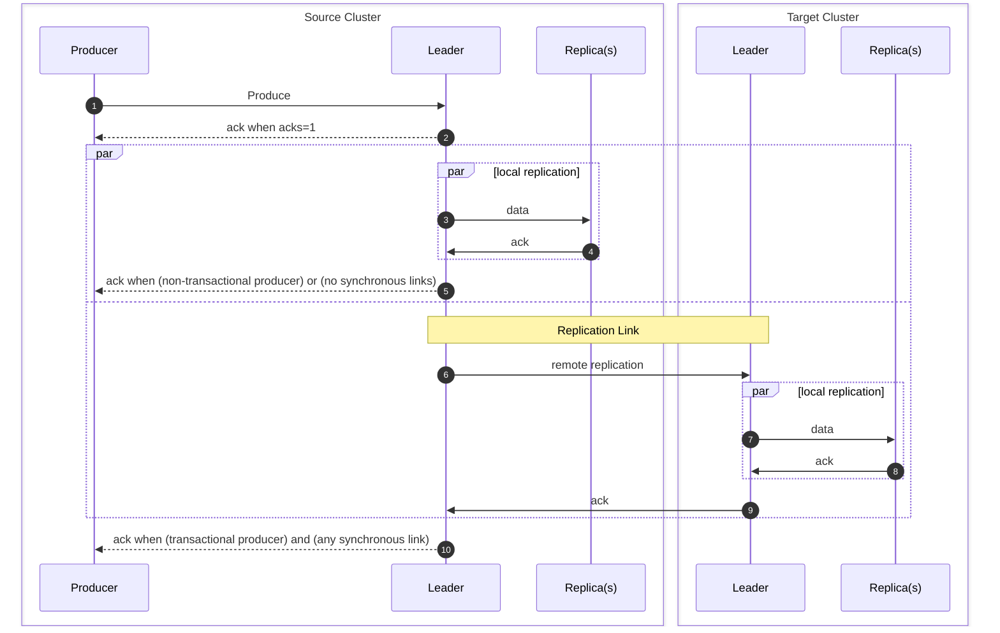

# Replication Sequence Diagram
This is a sequence diagram representing the messages sent to perform cross-cluster replication.

The "par" boxes represent operations which are taken in parallel to reduce overall latency.

The ack behavior of producers is affected by both the producer configuration, replication link configurations, and replication link states.
An ack is delivered to the producer after the record has been persisted on:

| Remote links               | Link state                    | Non-transactional producer | Transactional producer |
|----------------------------|-------------------------------|----------------------------|------------------------|
| No links                   | N/A                           | source ISR brokers         | source ISR brokers     |
| All links are asynchronous | Any                           | source ISR brokers         | source ISR brokers     |
| Any links are synchronous  | All In-Sync                   | source ISR brokers         | *target* ISR brokers   |
| Any links are synchronous  | Mixed In-Sync and Out-Of-Sync | source ISR brokers         | *offline*              |
| Any links are synchronous  | All Out-Of-Sync               | source ISR brokers         | *offline*              |

This means that synchronous links increase the ack latency, as the target ISR brokers must ack the records.
For replication links across different networks, synchronous links add 1-cross-network round-trip-time to the latency of the source producer.
A transactional producer needs two non-overlapping produces: the records, and the commit markers, and so incurs this penalty twice.

For example, if the latency for client-cluster is 10ms, inter-broker is 1ms, and cross-cluster is 100ms, the latency breakdown would be as follows:

| Segment            | Non-Transactional | Transactional | Transactional with Synchronous Link |
|--------------------|-------------------|---------------|-------------------------------------|
| InitProducerId     |                   | 10            | 10                                  |
| AddPartitionsToTxn |                   | 10            | 10                                  |
| Produce            | 10                | 10            | 10                                  |
| Replication        | 1                 | 1             | 101                                 |
| Commit             |                   | 10            | 10                                  |
| WriteTxnMarkers    |                   | 1             | 101                                 |
| Total              | 11                | 42            | 242                                 |

