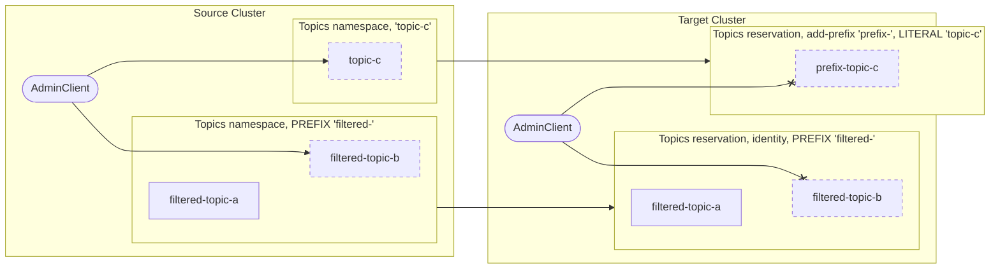

# Namespace Reservations

A Replication Link will include zero or more "namespace reservations". These prevent clusters involved in a cluster link from concurrently creating resources which would later conflict.

For example, a "topic namespace reservation" would ensure that target cluster clients cannot create topics with names that might also be mirrored from the source cluster.

The AdminClient in the source cluster is permitted to create the dashed topics which do not exist yet, and the AdminClient in the target cluster is not.
This ensures that the clusters agree at link-configure-time which cluster has control over what parts of the namespace.

### Properties
Reservations on the target cluster do not overlap, and give exclusive control of the reservation to the source cluster.
* If a new or modified reservation conflicts with an existing reservation, the new reservation will be rejected.
* If a new reservation is not empty (e.g. a resource already exists within the reservation), the new reservation will be rejected.
* If a modified reservation is strictly smaller than the existing reservation, the new reservation will be accepted.
* If a reservation modification includes existing resources (e.g. a regex was made more broad and now includes a topic which already exists), the new reservation will be rejected.

A reservation uses the mechanisms used for specifying ACLs to specify groups of topics, namely ResourcePattern and PatternType
A reservation can be for a single `LITERAL` resource, a group of resources with a common `PREFIX`, or `ALL` resources.
* If we were to use regexes to specify topics, then we could not easily ensure that two reservations did not overlap.
* We get to re-use the existing mechanisms that users are familiar with
* Users can easily map between reservations and their corresponding ACLs with the same scope.

A reservation also includes a "mapping function", which determines how to associate upstream and downstream resources.
Mapping functions must be deterministic and "prefix-preserving".
* Prefixes
* Suffixes
* ?

### Types
There are reservations for:
* topics
* consumer groups
* generic groups
* acls
* ?

Resources within a reservation are read-only while the reservation is active.
Disconnecting a link also releases all associated reservations, and makes the resources writable.

