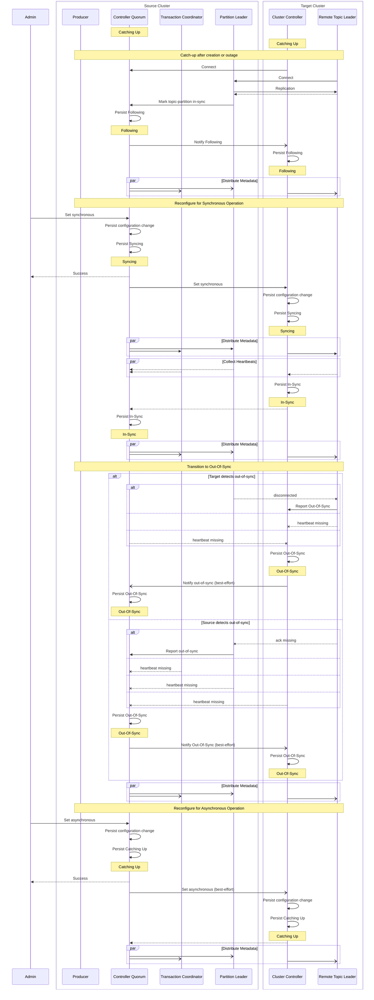

# State Transition Sequence Diagram

This diagram shows some example state transitions among the main "running" link states.
Catching Up -> Following -> Syncing -> In-Sync -> Out-Of-Sync -> Catching Up
